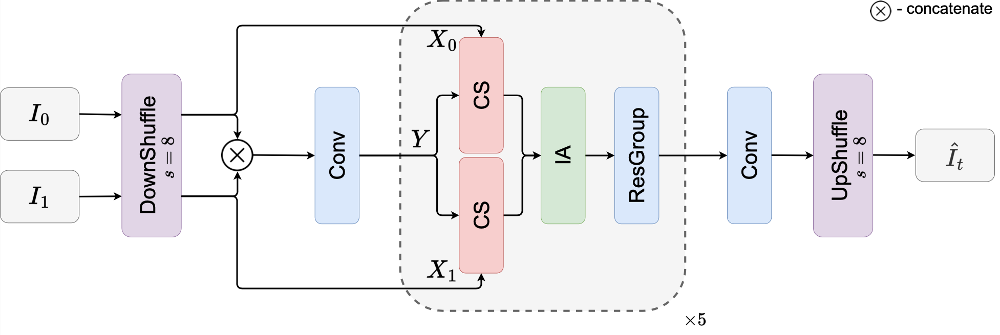
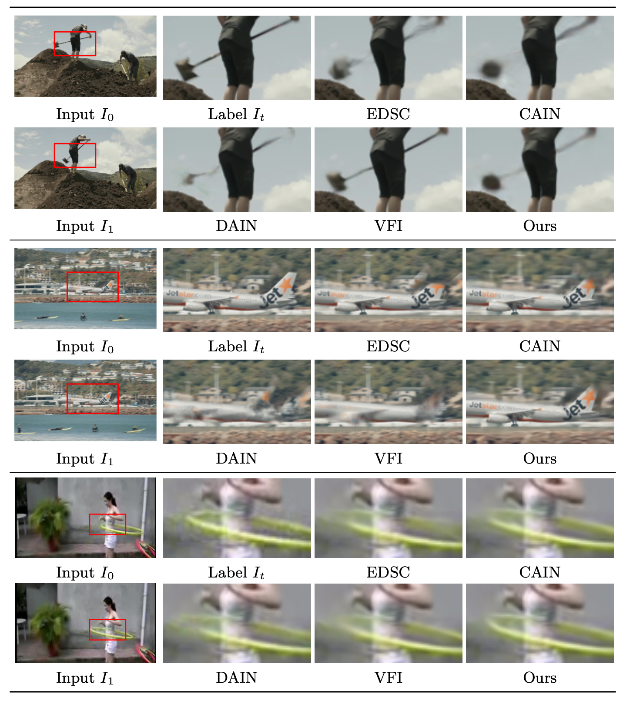

# Cross-Attention Transformer for Video Interpolation (TAIN)

This repository contains the inference code and the pre-trained model for our paper: <br/>
[Cross-Attention Transformer for Video Interpolation](https://openaccess.thecvf.com/content/ACCV2022W/TCV/papers/Kim_Cross-Attention_Transformer_for_Video_Interpolation_ACCVW_2022_paper.pdf)<br/>
ACCV Workshop 2022 [[Vision Transformers: Theory and Applications Workshop at ACCV 2022](https://sites.google.com/view/vtta-accv2022/home)] <br/>
Hannah Kim, Shuzhi Yu, Shuai Yuan, and Carlo Tomasi<br/>
<center></center>
 

## Citation
Please cite our paper if you find our code or paper useful.
```
@InProceedings{Kim_2022_ACCV,
    author    = {Kim, Hannah Halin and Yu, Shuzhi and Yuan, Shuai and Tomasi, Carlo},
    title     = {Cross-Attention Transformer for Video Interpolation},
    booktitle = {Proceedings of the Asian Conference on Computer Vision (ACCV) Workshops},
    month     = {December},
    year      = {2022},
    pages     = {320-337}
}
```


## Directory Structure
``` text
project
│   README.md
|   main.py - main file to run evaluation
|   config.py - check & change testing configurations here
|   loss.py - defines different loss functions
|   utils.py - misc.
└───run
|   │   eval_vimeo.sh - script to evaluate on Vimeo90k benchmark
|   │   eval_ucf.sh - script to evaluate on UCF101 benchmark
|   │   eval_snu.sh - script to evaluate on SNU-FILM benchmark
|   │   eval_middlebury.sh - script to evaluate on Middlebury benchmark
└───model
│   │   common.py
│   │   tain.py - main model
|   |   vt.py - vision transformer module
└───data - implements dataloaders for each dataset
│   |   vimeo90k.py - main training / testing dataset
│   |   ucf101.py - testing dataset
│   |   snufilm.py - testing dataset
│   |   middlebury.py - testing dataset
└───checkpoint - pre-trained model weights
│   └───TAIN
|       | ...
```


## Requirements
The code has been developed with 
- Python==3.7.11
- numpy==1.20.3
- PyTorch==1.8.1, torchvision==0.2.1, cudatoolkit==10.1
- tensorboard==2.6.0 
- opencv==3.4.2

```Shell
conda create -n tain
conda activate tain
conda install pytorch==1.8.1 torchvision==0.9.1 torchaudio==0.8.1 cudatoolkit=10.2 -c pytorch
conda install tensorboard
pip install einops
```

Download the [pre-trained model weights](https://drive.google.com/file/d/1x1aG3AxficsuGGcT3x--T5Li62NMBLrh/view?usp=sharing) and save in `checkpoint/TAIN/`.


## Dataset Preparation
- We use the following datasets for testing
  - **[Vimeo90K Triplet dataset](http://toflow.csail.mit.edu/)**
  - **[UCF101 dataset](https://paperswithcode.com/dataset/ucf101)**
  - **[SNU-FILM (SNU Frame Interpolation with Large Motion) dataset](https://myungsub.github.io/CAIN)**
  - **[Middlebury dataset](https://vision.middlebury.edu/flow/data/)**
- After downloading the full dataset, set its path to `--data_root`
  - Vimeo90k dataset, run `run/eval_vimeo.sh`
  - UCF101 dataset, run `run/eval_ucf.sh`
  - SNU-FILM dataset, run `run/eval_snu.sh`
    - Testing mode (choose from ['easy', 'medium', 'hard', 'extreme']) can be modified by changing `--test_mode` option.
  - Middlebury dataset, run `run/eval_middlebury.sh`


## Results
<center></center>
 Visualization of our proposed method and its comparison to the current state-of-the-art methods on examples from Vimeo90k and UCF101 dataset.


## Acknowledment & Reference
  - [CAIN](https://github.com/myungsub/CAIN) by myungsub.
  - [GMA](https://github.com/zacjiang/GMA) by lmb-zacjiang.
